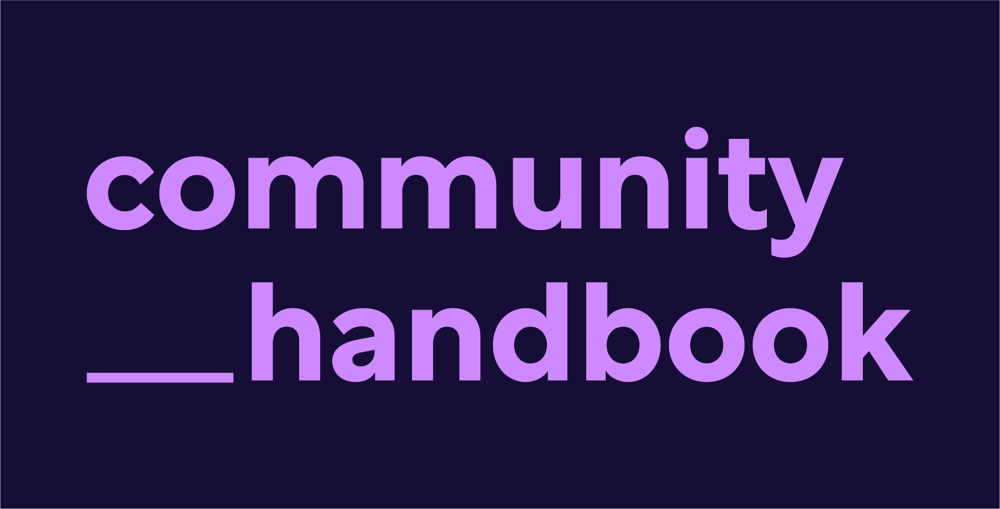

<div align="center">
 
</div>
<br>

## Useful links 🔗

| Information | Link                                                                                                                                                                                                                                                                                                                                                                                                                                                                                                                                                                                                                                                                                                                                                                                               |
| ----------- | -------------------------------------------------------------------------------------------------------------------------------------------------------------------------------------------------------------------------------------------------------------------------------------------------------------------------------------------------------------------------------------------------------------------------------------------------------------------------------------------------------------------------------------------------------------------------------------------------------------------------------------------------------------------------------------------------------------------------------------------------------------------------------------------------- |
| Project     | [](https://opensource.org/licenses/BSD-3-Clause) [](https://mentored-sprints.netlify.app/) [](https://github.com/pycon-mentored-sprints/community-handbook/blob/main/CONTRIBUTING.md) [](https://www.mentored-sprints.dev/getstarted/) |
| News        | [](https://twitter.com/mentoredsprints)                                                                                                                                                                                                                                                                                                                                                                                                                                                                                                                                                                                                                                                                       |
| Chat        | [](https://mentored-sprints.netlify.app/)                                                                                                                                                                                                                                                                                                                                                                                                                                                                                                                                                                                                                          |
| Build       | [](https://app.netlify.com/sites/mentored-sprints/deploys)                                                                                                                                                                                                                                                                                                                                                                                                                                                                                                                                                                                                                              |

- [Useful links 🔗](#useful-links-)
- [Development setup 💻](#development-setup-)
- [Working on the stylesheets/theme 🎨](#working-on-the-stylesheetstheme-)
- [Contributing 🤝](#contributing-)
- [Contributors ✨](#contributors-)
- [License 📄](#license-)

The Mentored Sprints Community Handbook is a collaborative handbook for organisers, mentors, and participants of open-source Contribution sprints. You're currently viewing the project GitHub repository where all the bits that make up the guide live, and where the process of writing/building the handbook happens.

## Development setup 💻

This Handbook is created using [Material for MKDocs](https://squidfunk.github.io/mkdocs-material/) and built and deployed using Netlify.
To set up your development environment you'll need:

- Python > 3.7
- git

Once you have forked and cloned the repository you can go ahead and set your development environment. Follow these steps:

1. Create a virtual environment:

   ```sh
     # first need to make sure we have everything installed
     python3 -m pip install --user virtualenv
     # this will create a .env directory at the root of your project
     python3 -m venv .env
   ```

2. Activate your environment

   ```bash
   source .env/bin activate
   ```

3. Install dependencies:

   ```sh
   $  python3 -m pip install -r requirements.txt
   ```

   Once your dependencies are installed and within your activated environment you should be able to live serve the site using:

   ```sh
   $ mkdocs serve
   ```

   Then head to [http://127.0.0.1:8000/](http://127.0.0.1:8000/) in your browser to see the changes reflected as you work on the handbook.

   Once done you can stop the server by typing <kbd>Ctrl</kbd> + <kbd>c</kbd> in your terminal and deactivate your environment with:

   ```sh
   deactivate
   ```

## Working on the stylesheets/theme 🎨

:warning: You will need to install [sass](https://sass-lang.com/) locally first.

The stylesheets are located in [.docs/stylesheets](.docs/stylesheets). As you work on them, you can compile them by typing in the terminal:

```sh
# adding the --watch will detect any chages and recompile the css
sass docs/stylesheets/custom.scss:docs/stylesheets/css/custom.css --watch
```

## Contributing 🤝

:construction: This repository is always a work in progress, and everyone is encouraged to help us build something useful to the many. :construction:

Everyone is asked to follow our [Code of Conduct](https://mentored-sprints.dev/code-conduct/code-conduct/) and to check out our [Contributing Guidelines](./CONTRIBUTING.md) for more information on how to get started.

## Contributors ✨

Thanks go to these wonderful people ([emoji key](https://allcontributors.org/docs/en/emoji-key)):

<!-- ALL-CONTRIBUTORS-LIST:START - Do not remove or modify this section -->
<!-- prettier-ignore-start -->
<!-- markdownlint-disable -->
<table>
  <tr>
    <td align="center"><a href="http://cheuk.dev"><br /><sub><b>Cheuk Ting Ho</b></sub></a><br /><a href="https://github.com/pycon-mentored-sprints/community-handbook/commits?author=Cheukting" title="Documentation">📖</a> <a href="#ideas-Cheukting" title="Ideas, Planning, & Feedback">🤔</a></td>
    <td align="center"><a href="https://github.com/vfdev-5"><br /><sub><b>vfdev</b></sub></a><br /><a href="https://github.com/pycon-mentored-sprints/community-handbook/issues?q=author%3Avfdev-5" title="Bug reports">🐛</a></td>
    <td align="center"><a href="https://www.linkedin.com/in/yashasvi-misra-094511165/"><br /><sub><b>Yashasvi Misra</b></sub></a><br /><a href="#projectManagement-yashasvimisra2798" title="Project Management">📆</a> <a href="https://github.com/pycon-mentored-sprints/community-handbook/commits?author=yashasvimisra2798" title="Code">💻</a></td>
    <td align="center"><a href="https://mukulikapahari.medium.com"><br /><sub><b>Mukulika</b></sub></a><br /><a href="#maintenance-Mukulikaa" title="Maintenance">🚧</a></td>
    <td align="center"><a href="https://github.com/MeekaElla"><br /><sub><b>Meeka</b></sub></a><br /><a href="#maintenance-MeekaElla" title="Maintenance">🚧</a></td>
    <td align="center"><a href="http://trangology.github.io"><br /><sub><b>trangology</b></sub></a><br /><a href="https://github.com/pycon-mentored-sprints/community-handbook/commits?author=trangology" title="Code">💻</a></td>
    <td align="center"><a href="https://github.com/anitatea"><br /><sub><b>Anita Tran</b></sub></a><br /><a href="https://github.com/pycon-mentored-sprints/community-handbook/commits?author=anitatea" title="Code">💻</a></td>
  </tr>
</table>

<!-- markdownlint-restore -->
<!-- prettier-ignore-end -->

<!-- ALL-CONTRIBUTORS-LIST:END -->

This project follows the [all-contributors](https://github.com/all-contributors/all-contributors) specification. Contributions of any kind are welcome!

## License 📄

The code for this site is Licensed as [BSD-3](https://opensource.org/licenses/BSD-3-Clause) and the content is licensed as
[CC-BY 4.0](http://creativecommons.org/licenses/by/4.0/) ⓒ[Mentored Sprints][ms-website].

<!-- Links -->

[ms-website]: https://mentored-sprints.dev
[community-handbook-repo]: https://github.com/pycon-mentored-sprints/community-handbook
