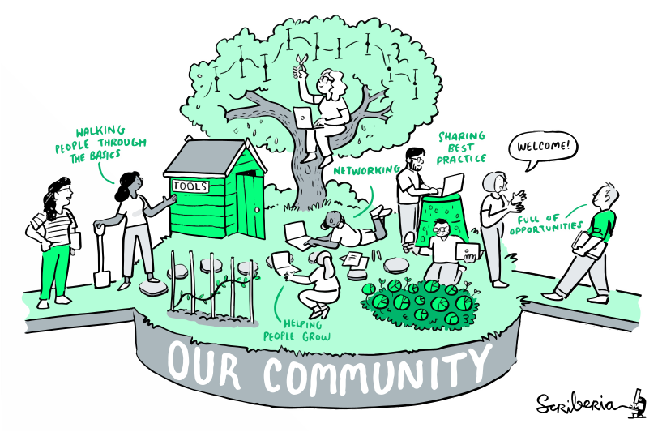

# Welcome

Welcome to the Mentored Sprints Community Handbook!

Our goal is to share our learnings from running coding sprints both, in-person and online with and for the broader community.
We have done a lot of the legwork and also some mistakes down the way. As a result, we decided to document some of the best practices and gotchas we have run into, so you do not have to.

We have envisioned this as a community-led and community-oriented project. So, in true community spirit, we would love to see other folks and sprint organisers contributing to this project and sharing their experiences. Every person and every contribution are welcome.

## Our Community

The **Mentored sprints** project is not only a series of coding sprints to contribute to open source. But **a community dedicated to mentor, support, and empower** all of those folks that have faced and continue to face barriers to contributing to open source.

In brief **Mentored Sprints** are:

- a community
- a community handbook (this document)
- a global collaboration
- an open effort to tackle some diversity and inclusion issues in the open-source community

We hope you find the content in this handbook useful. Everything here is available for free under a [CC-BY license](hhttps://github.com/pycon-mentored-sprints/mentored-sprints.dev/blob/main/LICENSE.md). Please use and reuse whatever you need for any purpose.

This handbook is collaboratively written and open from the start. To make this project truly accessible and useful for everyone, we invite you to contribute your skills and bring your perspectives to this project. To join this community, please read our [contribution guidelines](https://github.com/pycon-mentored-sprints/mentored-sprints.dev/blob/main/CONTRIBUTING.md) and ways to get in touch.
We look forward to expanding and building the Mentored Sprints Community Handbook together.

We value the participation of every member of our community. Furthermore, we want to ensure that every contributor has an enjoyable and fulfilling experience. Accordingly, everyone who participates in the Mentored Sprints project is expected to show respect and courtesy to other community members at all times. All contributions must abide by our [Code of Conduct](code-of-conduct/01-index.md).

<figure>
  
  <figcaption>The Turing Way project illustration by Scriberia. Zenodo:
  <a href="http://doi.org/10.5281/zenodo.3695300">http://doi.org/10.5281/zenodo.3695300
  </a>
  </figcaption>
</figure>

!!! info "Kudos"

    Loads of community growth inspiration have come from the [Turing Way project](https://the-turing-way.netlify.app/).
