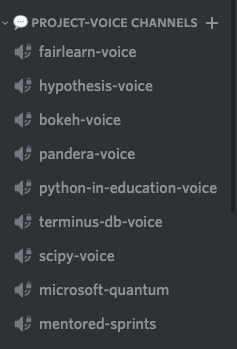
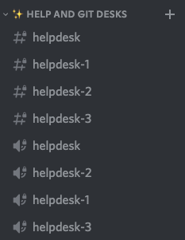
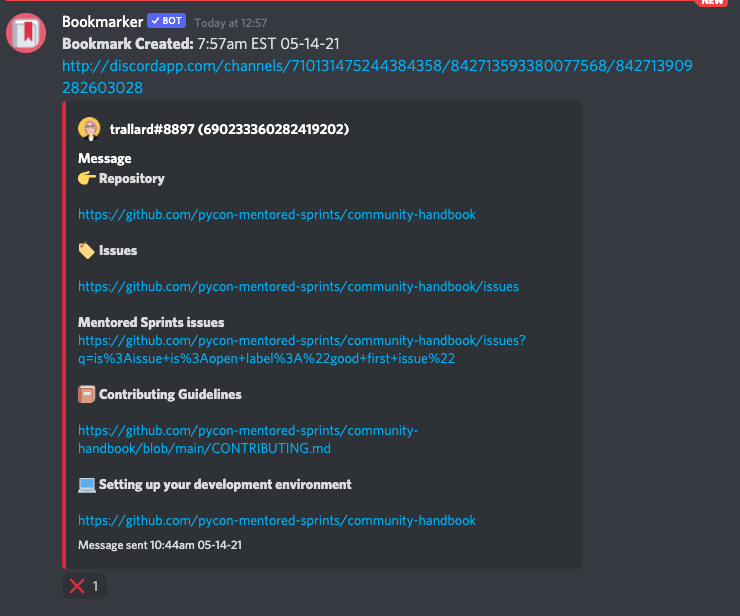

## :books: Project channels

Each project has a voice and a text channel. Voice channels can also be used for video and to share screens. The mentors will be available at the corresponding channel for support. Please be respectful of other contributors and mentors.

!!!info
You can identify mentors as they will have either the word `mentor` or the name of their project in their username. They will also be displayed in blue in the members area.

You can identify the voice channels as they are marked with a :mega::

## :bow: General help channels

Our general help channels are start with `#helpdesk`, and we have both, text and voice channels. This is a great choice for a generic Python question, or a Git question, and a good choice if you need an answer as soon as possible. It's particularly important to ask good questions when asking in these channels. These are monitored throughout the sprints.

### How to use a `helpdesk` channel

Start typing your question into one of these channels.
If you're unable to type into these channels, this means you're currently on cooldown. In order to prevent someone from claiming all the channels for themselves, we only allow someone to claim a new help channel every 5 minutes.

### Are only mentors supposed to answer questions?

Absolutely not. We strongly encourage all members of the community to help answer questions. If you'd like to help answer some questions, then head over to one of the help channels that are currently in use.

## :woman_technologist: Coworking channels

We have a number of coworking channels for you to use while pair-programming. We have given them identifiable names to make communication easier.
To use the coworking channels just jump into one and get pair-programming. Make sure to leave the channel when you are done, so others can use it.

## :bookmark: If you like it put a bookmark on it

Our server can get quite busy with folks helping, asking questions and dropping URLs.

We have now added a bookmarking bot to help you keep track of important links. If there is a message you want to bookmark add the :bookmark: reaction to it and the bot will send you a DM with all the messages you have bookmarked.

To remove a bookmark click on the :negative_squared_cross_mark: reaction on the DM.

## :zipper_mouth_face: Moderation

We have a high level of moderation to keep the server safe for everyone. Organisers are in charge of moderation.

!!!tip "Important"
If at any point you need to file a code of conduct incident head to `#coc-report` and use the command `!coc-report` this will trigger a **confidential** report.
We always have a CoC enforcement trained person on site during sprints.

For server level help or attention you can ping `@organisers` or `@core-team`
