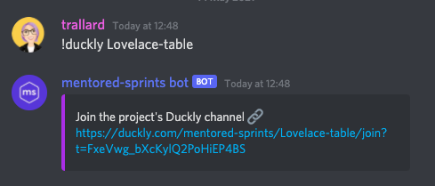

We are so glad you could join us here! We have put together these docs to get you all set and ready for the Mentored Sprints.

!!! Example "TL;DR"

    1. Join the Discord server
    2. Check the projects (in this page or in the Discord server - each project has a text and voice channel)
    3. Read the contributing guidelines and setup instructions for the project (linked here and in the project's channel)
    4. [Install tools, apps](./01-index.md#what-do-i-need-to-prepare-before-joining-the-sprint) and set your development environment (project specific)

## Discord server - setup

!!! tip
We highly recommend you [download the Discord desktop app](https://discord.com/download).

1. Join our Discord Server <br><br>
   [Join Discord :fontawesome-brands-discord:](https://discord.gg/H4fYmEe){ .md-button .md-button--primary }<br><br>
2. Once you join the server, you will be redirected to `#community-readme` and asked to accept the Code of Conduct
3. Introduce yourself in `#introductions`
4. Select your pronouns in `#pronouns` and choose roles in `#roles`
5. **Make sure to use your real name or your GitHub handle**

!!!important
Check [The Mentored Sprints Discord Server Guide](../mentors/03-discord.md) for details on how the server works and rules regarding rooms.

## Getting ready for the sprint

This might be your first sprint, so make sure to check the other sections in this handbook.
Mainly make sure to install all needed tools as described in [What do I need to prepare before joining the sprint?](./01-index.md#what-do-i-need-to-prepare-before-joining-the-sprint)

**In general, you will need:**

1. A computer with an Internet connection
2. Git installed
3. A GitHub account
4. Your favourite text editor / IDE
5. A working development environment for the project you will be working on
6. A Duckly account and needed plugins

!!!tip
We have listed the participating projects on this page. We highly recommend you to come prepared
and check the **Contributing guidelines** and the **Setting up your development environment** before the sprint.

## Sharing your screen and code

We know pair programming and remote debugging can be challenging. This year we are using Duckly.
Duckly is a video chat and real-time collaboration tool built for teams. It enables distributed teams to talk and work together in a better and more efficient way. With Duckly, you can share a web page, your code directly from your IDE, share your terminal, screen and collaborate as if you were side-by-side.

!!!warning "Important"
You should have received an invitation link to join the Duckly team space. Otherwise, [head to this message in the Discord server](https://discord.com/channels/710131475244384358/710131475973931070/842771189814657084)

To get started, follow these steps:

1. Create a Duckly account and select your username: <https://duckly.com/onboarding>

2. Click on the invite link and join the mentored-sprints team

3. Install the relevant plugins based on which IDE you use: <https://duckly.com/faq> or <https://duckly.com/tools>

You can check the getting started with Duckly video here: <https://youtu.be/YzCPCRTIEPs>

### Using the Duckly rooms

When you join our team, you will see a left-sidebar similar to the Discord panel. We have created a room per project and additional help tables: **Curie, Lovelace, Hopper, Turing, Ride, Barres and Johnson**.


- **To join a room:** click on the room name. You can then choose your mic, camera, share your terminal and IDE.
- **To leave a room:**Click on the **leave** button on the top-right corner

!!!info
Since Duckly does not have persistent text chats, we use both Discord and Duckly - let's keep Discord for text and Duckly for code walkthroughs and debugging.

### Duckly from Discord

Suppose you and your co-worker need to jump into a Duckly room while working. To get the link and invite folks we recommend using the Discord commands to invoke the coworking tables:

```text
# Use either of these

!duckly Curie-table
!duckly Hopper-table
!duckly Lovelace-table
!duckly Turing-table
!duckly Ride-table
!duckly Barres-table
!duckly Johnson-table
```

This will display the Duckly room link and should work in all Discord channels:



## Participating projects


### Fairlearn

:link: [Repository](https://github.com/fairlearn/fairlearn)

:label: [Issues](https://github.com/fairlearn/fairlearn/issues)

:raising_hand: [Beginner-friendly issues](https://github.com/fairlearn/fairlearn/issues?q=is%3Aopen+is%3Aissue+label%3A%22help+wanted%22)

:books:[Contributing Guidelines](https://fairlearn.org/main/contributor_guide/index.html)

:computer: [Setting up your development environment](https://fairlearn.org/main/contributor_guide/development_process.html)

:book: [Documentation](https://fairlearn.org/main/contributor_guide/contributing_documentation.html)

---


### Hypothesis and Shed

:link: [Repository](https://github.com/HypothesisWorks/hypothesis)

:label: [Issues](https://github.com/HypothesisWorks/hypothesis/issues)

:books:[Contributing Guidelines](https://github.com/HypothesisWorks/hypothesis/blob/master/CONTRIBUTING.rst)

:computer: [Setting up your development environment](https://github.com/HypothesisWorks/hypothesis/blob/master/CONTRIBUTING.rst#installing-from-source-and-testing)

---


### Bokeh

:link: [Repository](https://github.com/bokeh/bokeh/)

:label: [Issues](https://github.com/bokeh/bokeh/issues)

:raising_hand: [Beginner-friendly issues](https://github.com/bokeh/bokeh/issues?q=is%3Aissue+is%3Aopen+label%3A%22good+first+issue%22)

:books:[Contributing Guidelines](https://github.com/bokeh/bokeh/blob/branch-2.4/.github/CONTRIBUTING.md)

:computer: [Setting up your development environment](https://docs.bokeh.org/en/latest/docs/dev_guide/setup.html#devguide-setup)

---


### Pandera

:link: [Repository](https://github.com/pandera-dev/pandera)

:label: [Issues](https://github.com/pandera-dev/pandera/issues)

:raising_hand: [Beginner-friendly issues](https://github.com/pandera-dev/pandera/issues?q=is%3Aissue+is%3Aopen+label%3A%22good+first+issue%22)

:books:[Contributing Guidelines](https://github.com/pandera-dev/pandera/blob/master/.github/CONTRIBUTING.md)

:computer: [Setting up your development environment](https://github.com/pandera-dev/pandera/blob/master/.github/CONTRIBUTING.md)

---


### Terminus DB / Terminus Client

:link: [Repository](https://github.com/terminusdb/terminusdb-client-python)

:label: [Issues](https://github.com/terminusdb/terminusdb-client-python/issues)

:raising_hand: [Beginner-friendly issues](https://github.com/terminusdb/terminusdb-client-python/issues?q=is%3Aopen+is%3Aissue+label%3A%22good+first+issue%22)

:books:[Contributing Guidelines](https://github.com/terminusdb/terminusdb-client-python/blob/master/CONTRIBUTING.md)

---


### SciPy

:link: [Repository](https://github.com/scipy/scipy)

:label: [Issues](https://github.com/scipy/scipy/issues)

:raising_hand: [Beginner-friendly issues](https://github.com/scipy/scipy/issues?q=is%3Aopen+is%3Aissue+label%3A%22good+first+issue%22)

:books:[Contributing Guidelines](http://scipy.github.io/devdocs/dev/index.html#scipy-development)

:computer: [Setting up your development environment](https://scipy.github.io/devdocs/dev/contributor/contributor_toc.html#development-environment)

---

### Python in education

:link: [Repository](https://github.com/psf/python-in-edu)

:label: [Issues](https://github.com/psf/python-in-edu/issues)

:books:[Contributing Guidelines](https://github.com/psf/python-in-edu/blob/master/README.md)

---

### Microsoft Quantum

:link: [Repository](https://github.com/microsoft/Quantum)

:label: [Issues](https://github.com/microsoft/Quantum/issues)

:raising_hand: [Beginner-friendly issues](https://github.com/microsoft/Quantum/issues?q=is%3Aissue+is%3Aopen+label%3A%22good+first+issue%22)

:books:[Contributing Guidelines](https://github.com/microsoft/Quantum/blob/main/CONTRIBUTING.md)

:computer: [Setting up your development environment](https://github.com/microsoft/Quantum#setting-up-your-development-environment)

:whale: [Docker](https://github.com/microsoft/Quantum#running-a-jupyter-notebook-with-docker)

:book: [Documentation](https://docs.microsoft.com/en-gb/azure/quantum/)

---


### NumPy

:link: [Repository](https://github.com/numpy/numpy)

:label: [Issues](https://github.com/numpy/numpy/issues)

:raising_hand: [Beginner-friendly issues](https://github.com/numpy/numpy/issues?q=is%3Aopen+is%3Aissue+label%3A%22good+first+issue%22)

:books:[Contributing Guidelines](https://numpy.org/devdocs/dev/index.html#guidelines)

:computer: [Setting up your development environment](https://numpy.org/devdocs/dev/development_environment.html)

---


### Mentored Sprints

:link: [Repository](https://github.com/pycon-mentored-sprints/community-handbook)

:label: [Issues](https://github.com/pycon-mentored-sprints/community-handbook/issues)

:raised_hand:[Mentored Sprints issues](https://github.com/pycon-mentored-sprints/community-handbook/issues?q=is%3Aissue+is%3Aopen+label%3A%22good+first+issue%22)

:books: [Contributing Guidelines](https://github.com/pycon-mentored-sprints/community-handbook/blob/main/CONTRIBUTING.md)

:computer: [Setting up your development environment](https://github.com/pycon-mentored-sprints/community-handbook)
